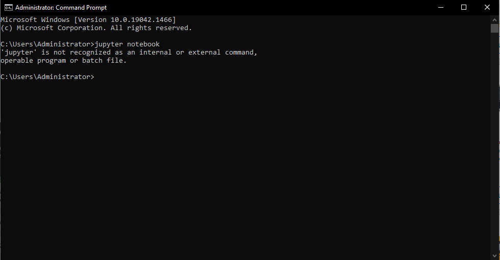
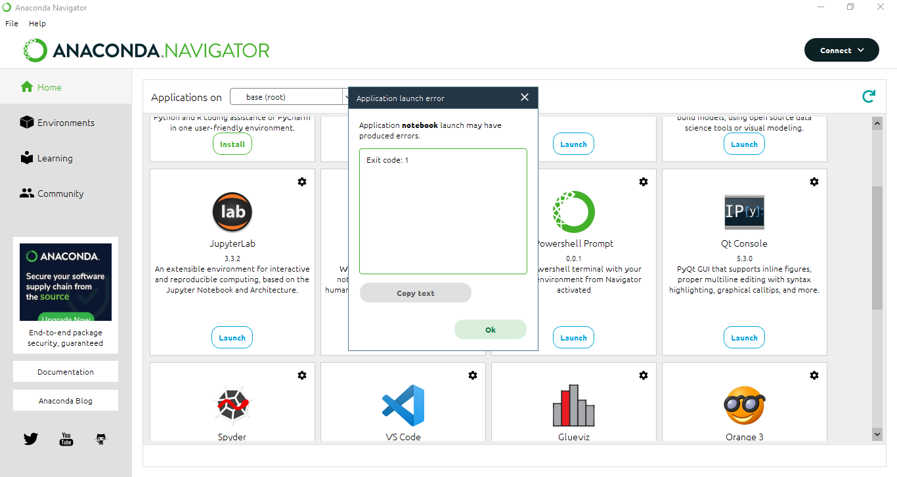
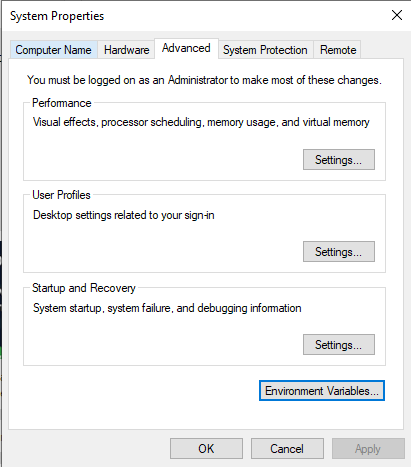
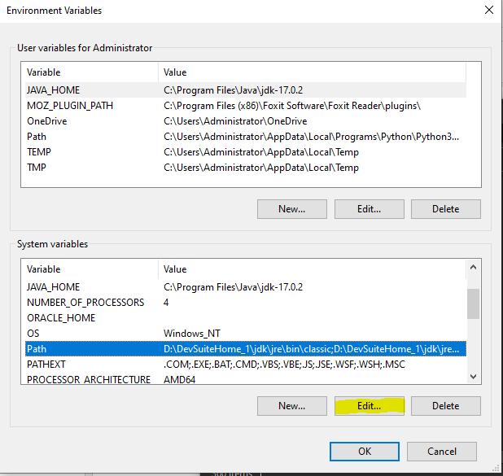
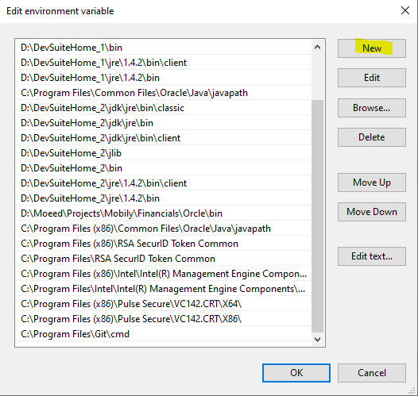
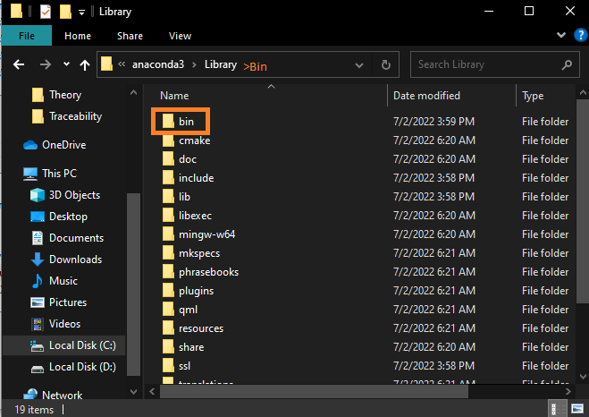
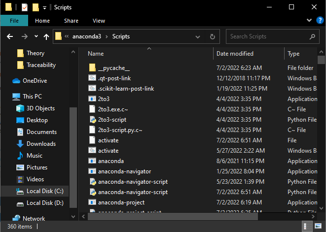
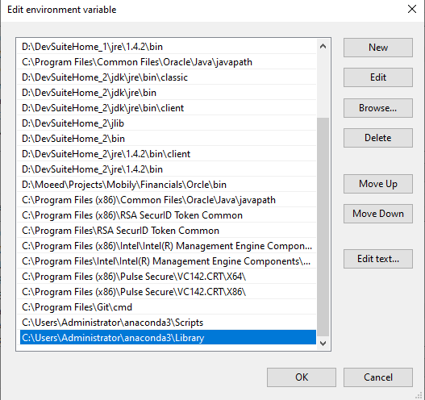
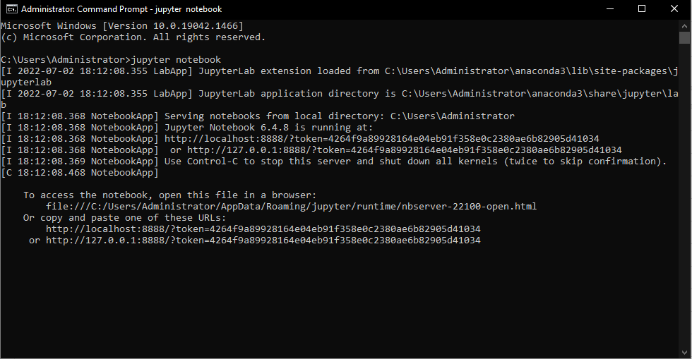

# Exit Code 1 Error in Anaconda
## How to identify and resolve this issue.
### Step by step process. 
Visual Studio Code ModuleNotFoundError: No Module Named Seaborn
    it is just because you are using python terminal which is 
    not suitable for seaborn all you have to do is just to 
    Go View tab in VS code and then type "python:select terminal"
    and change it with Conda.
    this will resolve this issue.

## How to Identify Error
***

- We'll go to Start Window and navigate to Environment variables.\
- we'll nevigate to system properties.\
- click on 'Environment Variables..'

- Goto system Variable and click 'Edit button'

- Click 'New'

- Go to anaconda3>library>bin location and copy it.

- Also go to scrips folder and copy its location too.
- and create two new variables.

- Here are two variables added in the last of this list(in picture).

-  Issue Resolved 

